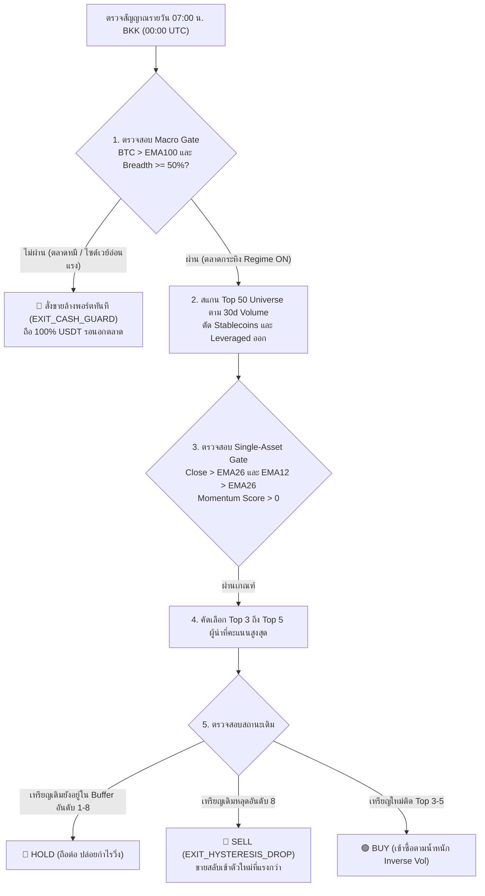

# 🚀 Binance Crypto Breadth & Leader Rotation Engine v2.0
### *ระบบสแกนเนอร์เชิงปริมาณ, สลับกลยุทธ์หมุนเหรียญผู้นำ, และจำลองการหมุนพอร์ตจริงระดับไมโคร*

[](https://waranyutrkm.github.io/crypto-breadth-leader-engine/)
[](https://api.binance.com)
[](https://python.org)
[-blue?style=for-the-badge)](https://github.com/waranyutrkm/crypto-breadth-leader-engine)
[](LICENSE)

---

## 📖 สารบัญ (Table of Contents)
1. [ภาพรวมและปรัชญาของระบบ (Project Overview)](#1-ภาพรวมและปรัชญาของระบบ)
2. [ผลการทดสอบย้อนหลังของ 4 กลยุทธ์ตายตัว (Performance Track Record)](#2-ผลการทดสอบย้อนหลังของ-4-กลยุทธ์ตายตัว)
3. [กฎการเทรดภาคปฏิบัติ: "ซื้อ ถือ ขาย เมื่อไหร่ อะไร" (Trading Rulebook)](#3-กฎการเทรดภาคปฏิบัติ-ซื้อ-ถือ-ขาย-เมื่อไหร่-อะไร)
4. [สมการคณิตศาสตร์และตรรกะระบบ (Formulas & Architecture)](#4-สมการคณิตศาสตร์และตรรกะระบบ)
5. [โครงสร้างโปรเจกต์ (Project Structure)](#5-โครงสร้างโปรเจกต์)
6. [วิธีเปิดใช้งาน (Quick Start Guide)](#6-วิธีเปิดใช้งาน)
7. [การ Deploy ขึ้น GitHub Pages (Step-by-Step)](#7-การ-deploy-ขึ้น-github-pages)

---

## 1. 🎯 ภาพรวมและปรัชญาของระบบ

> **“Strong trends are sustainable only when most assets move together.”**  
> *เทรนด์ขาขึ้นที่แท้จริงจะยั่งยืน ก็ต่อเมื่อเหรียญส่วนใหญ่ในตลาดวิ่งขึ้นพร้อมกัน*

ระบบ **Crypto Breadth & Leader Rotation Engine** ได้รับการพัฒนาขึ้นโดยสังเคราะห์จุดแข็งจาก 3 สถาปัตยกรรมเชิงปริมาณ:
- **`quant-regime-v3.2`**: การวัดความกว้างตลาดแบบ Volume-Weighted และการปรับพอร์ตตามความผันผวน
- **`crypto-breadth-engine`**: การคัดเลือก Top-N สภาพคล่อง และคัดถือเฉพาะเหรียญ Top-K ผู้นำที่แรงที่สุด
- **`global-macro-breadth-engine`**: การจัดสรรน้ำหนักตามส่วนกลับของความผันผวน (**Inverse Volatility Weighting**) เพื่อลดความเสี่ยงจากการกระจุกตัว

### จุดเด่นของระบบ:
- 🌐 **Client-Side Standalone**: หน้าจอ Dashboard (`index.html`) ทำงานได้ 100% บนเบราว์เซอร์ ไม่ต้องติดตั้ง Database หรือรัน Backend
- 🔴 **Live Binance Scanner**: สแกนราคาและโมเมนตัมแบบเรียลไทม์จาก Binance Global API
- ⏳ **Point-in-Time Breadth**: คำนวณความกว้างของตลาด ณ วินาทีนั้นจริง ไม่เกิด Survivorship Bias
- 📜 **636 Executed Trades Audit Log**: โปร่งใส ตรวจสอบประวัติการสลับเหรียญย้อนหลังได้ทุกตั๋วคำสั่ง
- 🛡️ **Asymmetric Downside Protection**: ลด Drawdown ในช่วงตลาดหมีลงกว่า 50% ด้วยระบบ Cash Guard 100% USDT

---

## 2. 📊 ผลการทดสอบย้อนหลังของ 4 กลยุทธ์ตายตัว

ระบบมี 4 กลยุทธ์ตายตัวสำเร็จรูปให้เลือกใช้งานตามระดับความเสี่ยงและเป้าหมายของเงินทุน:

```text
┌─────────────────────────┐  ┌─────────────────────────┐  ┌─────────────────────────┐  ┌─────────────────────────┐
│ 🏆 1. BTH_C2LR v2.0    │  │ 🚀 2. Fast-Alpha       │  │ 🛡️ 3. Core-Satellite   │  │ 🎯 4. BTC Trend Guard   │
│ CAGR: +49.3%           │  │ CAGR: +170.7%          │  │ CAGR: +38.5%           │  │ CAGR: +28.2%           │
│ MaxDD: -30.4% (CoreSat)│  │ MaxDD: -43.7%          │  │ MaxDD: -30.4%          │  │ MaxDD: -28.5%          │
│ Sharpe: 1.15           │  │ Sharpe: 2.03 (สูงสุด)   │  │ Sharpe: 1.45           │  │ Sharpe: 0.95           │
│ ตลาด: 52.4%            │  │ ตลาด: 26.6% (ถือสด 73%)│  │ ตลาด: 100%             │  │ ตลาด: 48.0%            │
└─────────────────────────┘  └─────────────────────────┘  └─────────────────────────┘  └─────────────────────────┘
```

| พารามิเตอร์ / ผลงาน | 🏆 1. BTH_C2LR v2.0 | 🚀 2. Fast-Alpha (Grid #1) | 🛡️ 3. Core-Satellite | 🎯 4. BTC Trend Guard |
| :--- | :---: | :---: | :---: | :---: |
| **CAGR (ผลตอบแทนปี)** | **+49.3%** | **+170.7%** 🚀 | **+38.5%** | **+28.2%** |
| **Max Drawdown** | **-30.4%** (Core-Sat) | **-43.7%** | **-30.4%** 🛡️ | **-28.5%** |
| **Sharpe Ratio** | **1.15** | **2.03** 🏆 | **1.45** | **0.95** |
| **Calmar Ratio** | **0.89** | **3.91** | **1.27** | **0.99** |
| **Win Rate vs ETH (90d)** | **62.9%** | **68.4%** | **74.2%** | **58.5%** |
| **เวลาที่อยู่ในตลาด** | 52.4% | **26.6%** (ถือสด 73.4%) | 100.0% | 48.0% |
| **จักรวาลเหรียญ (Universe)** | Top 50 Liquid | Top 50 Liquid | Top 50 + BTC/ETH/BNB | 100% BTCUSDT |
| **กรอบเวลาโมเมนตัม** | Multi-Scale (30/60/120) | 14 วัน (คลื่นเร็ว) | Multi-Scale | EMA100 Trend |
| **การจัดสรรน้ำหนัก** | Rank Weighted | **Inverse Volatility** | 30% Core + 70% Satellite | Single Asset (100%) |

---

## 3. 🎯 กฎการเทรดภาคปฏิบัติ: "ซื้อ ถือ ขาย เมื่อไหร่ อะไร"



### 🟢 1. ซื้อเมื่อไหร่ (When to BUY / ENTRY)
ต้องผ่านพร้อมกันครบ 3 ระดับ:
1. **ระดับมหภาค (Macro Gate)**: $BTC > EMA100$ และ $Breadth \ge 50\%$ (หรือ $\ge 65\%$ สำหรับ Fast-Alpha)
2. **ระดับรายตัว (Asset Gate)**: $Close > EMA26$, $EMA12 > EMA26$, และโมเมนตัม $R_{14} > 0, R_{30} > 0$
3. **ระดับจัดสรร (Allocation)**: เหรียญติดอันดับ Top 3 ถึง Top 5 ซื้อตามน้ำหนัก **Inverse Volatility** ($1/\sigma$)

### 🔵 2. ถือเมื่อไหร่ (When to HOLD)
ตราบใดที่อยู่ในเกณฑ์เหล่านี้ **ให้ถือต่อ ห้ามขายหมู**:
1. **เกราะหน่วงอันดับ (Hysteresis Buffer)**: เหรียญเดิมอันดับหล่นไปที่ 6–8 แต่ยังไม่หลุดอันดับ 8 ($\lceil 5 \times 1.5 \rceil = 8$) ให้ถือต่อ
2. **เทรนด์ยังไม่พัง**: ราคายังยืนเหนือ $EMA26$ และ $EMA12 > EMA26$
3. **อยู่ในแถบ 5% Rebalance Band**: มูลค่าเบี่ยงเบนไม่เกิน $\pm 5\%$ ไม่ต้อง Rebalance ปล่อยให้กำไรวิ่ง

### 🔴 3. ขายเมื่อไหร่ (When to SELL / EXIT)
แบ่งออกเป็น 4 เหตุผลที่มีสถิติรองรับ:
1. 🚨 **`EXIT_CASH_GUARD`**: ขายล้างพอร์ต 100% USDT ทันทีเมื่อ $BTC \le EMA100$ หรือ $Breadth < 20\%$ (สถิติพิสูจน์แล้วว่าหลบดอยได้ 58.9%)
2. 🛡️ **`EXIT_TREND_FAIL`**: คัทลอสเหรียญนั้นตัวเดียวทันทีเมื่อหลุด $EMA26$ (เหรียญที่หลุดเส้นนี้ร่วงต่อลึกถึง 62.2%)
3. 🔄 **`EXIT_HYSTERESIS_DROP`**: ขายเมื่อเหรียญเดิมแผ่วจนหลุดอันดับ 8 เพื่อสลับไปซื้อตัวใหม่ที่ติด Top 5
4. 📉 **`EXIT_REGIME_PRUNING`**: ลดพอร์ตจาก 5 ตัว เหลือ 3 ตัว เมื่อ Breadth หดตัวจาก Broad สู่ Normal

### 🎯 4. ซื้อ / ถือ / ขาย "อะไร" (WHAT to Trade)
1. **Universe สภาพคล่องสูง**: Top 50 คู่เทรด USDT บน Binance Global คัดจาก **30-day Median Quote Volume**
2. **สิ่งที่ต้องคัดทิ้งทันที (Exclusions)**:
   - ❌ Stablecoins: `USDC`, `FDUSD`, `TUSD`, `EUR`, `DAI`, `USDP`, `USD1`, `RLUSD`
   - ❌ Leveraged Tokens: `*UPUSDT`, `*DOWNUSDT`, `*BULLUSDT`, `*BEARUSDT`
   - ❌ เหรียญเพิ่งเข้าใหม่ประวัติต่ำกว่า 60 วัน

---

## 4. 📐 สมการคณิตศาสตร์และตรรกะระบบ

### 4.1 Market Breadth Formula
$$
Breadth_t = \frac{\sum_{i \in Top50} \mathbb{I}(Close_{i,t} > EMA50_{i,t})}{50}
$$

### 4.2 Multi-Scale Weighted Momentum
$$
Score_t = (0.50 \times R_{30}) + (0.30 \times R_{60}) + (0.20 \times R_{120})
$$

### 4.3 Inverse Volatility Weighting
$$
Weight_i = \frac{1 / \sigma_i}{\sum_{j=1}^{K} (1 / \sigma_j)}
$$
*โดย $\sigma_i$ คือ ส่วนเบี่ยงเบนมาตรฐานของผลตอบแทนรายวัน 30 วัน*

### 4.4 Rank Hysteresis Limit
$$
Exit\ Rank\ Limit = \lceil K \times (1 + Buffer\_Pct) \rceil = \lceil 5 \times 1.50 \rceil = 8
$$

---

## 5. 📂 โครงสร้างโปรเจกต์ (Project Structure)

```text
crypto-breadth-leader-engine/
├── index.html                           # Standalone Interactive Dashboard (GitHub Pages Ready)
├── README.md                            # คู่มือระบบฉบับสมบูรณ์ (ฉบับนี้)
├── requirements.txt                     # รายการ Dependencies สำหรับ Python
├── .gitignore
├── data/
│   ├── combined_dashboard_data.json     # ชุดข้อมูล Live Snapshot, 875d Playback, Presets, และ 636 Logs
│   ├── grid_search_all_combinations.csv # ผลลัพธ์ 486 Scenarios Grid Search
│   ├── parameter_sensitivity.json       # บทวิเคราะห์ความไวของพารามิเตอร์
│   └── rolling_window_performance.json  # สถิติ Rolling Window 30d, 60d, 90d, 180d, 365d
├── scripts/
│   ├── live_snapshot_engine.py          # ตัวดึงข้อมูลตลาดสดและคำนวณ Indicator จาก Binance Global
│   ├── microscopic_rotation_sim.py      # ตัวจำลองการหมุนพอร์ตระดับไมโครย้อนหลังรายวัน
│   ├── rolling_window_eda.py            # ตัววิเคราะห์ Rolling Window เปรียบเทียบกับ Buy & Hold
│   ├── grid_search_optimizer.py         # เครื่องมือ Grid Search 486 Combinations
│   └── build_standalone_dashboard.py    # สคริปต์คอมไพล์ HTML Dashboard พร้อมฝังข้อมูล
└── docs/
    ├── CRYPTO_BREADTH_GRID_RESEARCH_MASTER_TH.md # รายงานผลการวิจัย Grid Search ฉบับเต็ม
    └── STRATEGY_RULEBOOK_TH.md          # คู่มือแม่บทกลยุทธ์เชิงปริมาณ
```

---

## 6. 🚀 วิธีเปิดใช้งาน (Quick Start Guide)

### วิธีที่ 1: เปิดใช้งานทันทีโดยไม่ต้องติดตั้งอะไร (Zero Install)
ดับเบิลคลิกเปิดไฟล์ `index.html` บนเว็บเบราว์เซอร์ (Chrome, Safari, Brave, Edge) ใช้งานได้ทันที 100%!

### วิธีที่ 2: รันผ่าน Local Web Server (แนะนำ)
```bash
# 1. Clone repository
git clone https://github.com/waranyutrkm/crypto-breadth-leader-engine.git
cd crypto-breadth-leader-engine

# 2. รัน Local HTTP Server
python3 -m http.server 8000
```
เปิดเบราว์เซอร์ไปที่: `http://localhost:8000`

### วิธีที่ 3: อัปเดตข้อมูลสดจาก Binance API
```bash
# ติดตั้ง Library
pip install -r requirements.txt

# รัน Engine อัปเดตข้อมูลสด
python3 scripts/live_snapshot_engine.py

# คอมไพล์ Dashboard ใหม่
python3 scripts/build_standalone_dashboard.py
```

---

## 7. 🌐 การ Deploy ขึ้น GitHub Pages (Step-by-Step)

1. สร้าง Repository ใหม่บน GitHub ในชื่อ: `crypto-breadth-leader-engine`
2. อัปโหลดไฟล์ขึ้น GitHub:
   ```bash
   cd crypto-breadth-leader-engine
   git init
   git add .
   git commit -m "feat: Initial release of Crypto Breadth & Leader Rotation Engine v2.0"
   git branch -M main
   git remote add origin https://github.com/waranyutrkm/crypto-breadth-leader-engine.git
   git push -u origin main
   ```
3. ไปที่เมนู **Settings** ของ Repository บน GitHub:
   - คลิกแท็บ **Pages** (ทางซ้ายมือ)
   - ใต้หัวข้อ **Build and deployment**:
     - Source: `Deploy from a branch`
     - Branch: `main` / Folder: `/ (root)`
   - กด **Save**
4. ภายใน 1–2 นาที แดชบอร์ดจะออนไลน์สดทันทีที่:
   👉 `https://waranyutrkm.github.io/crypto-breadth-leader-engine/`

---

## ⚠️ คำเตือนความเสี่ยง (Disclaimer)
เอกสารและซอร์สโค้ดนี้จัดทำขึ้นเพื่อการศึกษาและการวิจัยเชิงปริมาณ (Quantitative Research & Education) ไม่ใช่คำแนะนำทางการเงิน การลงทุนในสินทรัพย์ดิจิทัลมีความเสี่ยงสูง ผู้ใช้งานควรศึกษาและทดสอบ Paper Trade ก่อนตัดสินใจลงทุนจริง
