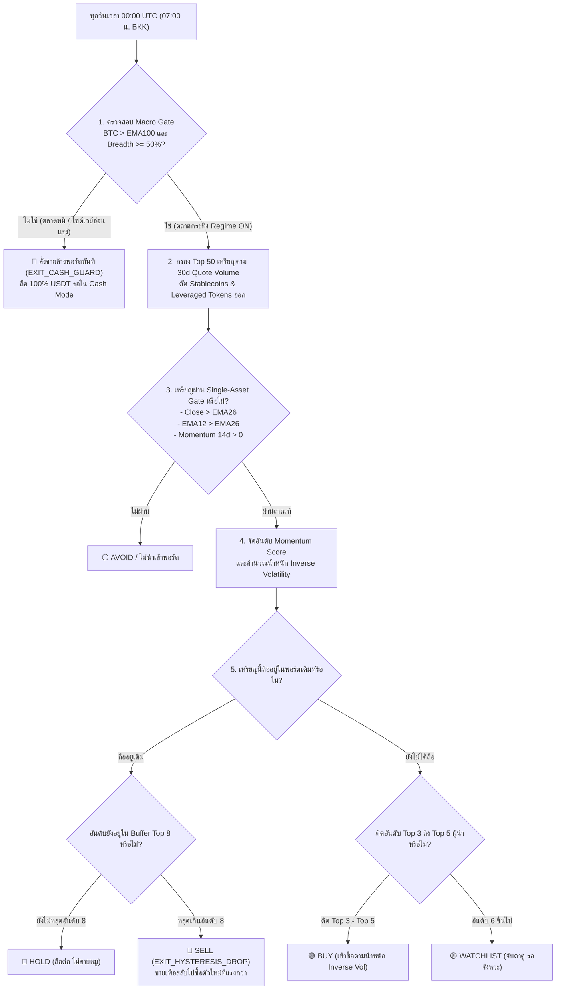

# พิมพ์เขียววิจัยเชิงปริมาณ: การสังเคราะห์ 3 Breadth Engines และผลทดสอบ Grid Search บน Binance Global
### *คู่มือกลยุทธ์ฉบับปฏิบัติการ: "ซื้อ ถือ ขาย เมื่อไหร่ อะไร" สำหรับการเทรด Crypto*

---

## 1. 🔬 สรุปและถอดรหัสสถาปัตยกรรมของ 3 GitHub Engines

จากการศึกษาซอร์สโค้ดและตรรกะของทั้ง 3 ระบบ:

| มิติการทำงาน | 1. `quant-regime-v3.2` | 2. `crypto-breadth-engine` | 3. `global-macro-breadth-engine` |
| :--- | :--- | :--- | :--- |
| **ลิงก์ต้นทาง** | [quant-regime-v3.2](https://github.com/waranyutrkm/quant-regime-v3.2) | [crypto-breadth-engine](https://github.com/waranyutrkm/crypto-breadth-engine) | [global-macro-breadth-engine](https://github.com/waranyutrkm/global-macro-breadth-engine) |
| **แหล่งข้อมูล** | Binance Futures API (`/fapi/v1/klines`) | Binance Spot API (`/api/v3/klines`) | Yahoo Finance API (Daily & Hourly) |
| **การคัดเลือก Universe** | Dynamic Top 80 ตาม 24h Quote Volume | Dynamic Top N ตาม Liquidity ($Price \times Volume$) | Top N สภาพคล่องสะสมจาก Lookback Window |
| **สูตร Breadth** | Volume-Weighted: $\frac{\sum Vol_{bullish}}{\sum Vol_{total}}$ โดย Bullish คือ $EMA_{fast} > EMA_{slow}$ | Count-Based: $\frac{\text{Coins with } R_{LB} > 0}{N}$ | Count-Based: $\frac{\text{Assets with } Momentum > 0}{N}$ |
| **การกรองสัญญาณ** | Breadth Smoothing (EMA) + Adaptive Scaling | Regime ON/OFF Filter (ถ้า $bVal \ge TH$ คือ ON) | Smart-Switch (BUY / HOLD / SELL / WAIT) |
| **การจัดพอร์ต** | Portfolio Exposure ปรับตาม Volatility Targeting | คัดเลือก **Top K Leaders** ตามโมเมนตัม ถือ Equal-Weight | **Inverse Volatility Basket Weighting** ($1/\sigma$) |
| **ต้นทุนการเทรด** | หักต้นทุน Turnover ตามสัดส่วนการเปลี่ยนพอร์ต | หักต้นทุนคงที่ ($TOTAL\_COST$) ทุกครั้งที่ Regime พลิก | หักค่าคอมมิชชั่นซื้อ-ขายและ Management Fee รายวัน |

---

## 2. 📊 ผลการทดสอบเชิงปริมาณ Grid Search ข้าม 486 สภาวะพารามิเตอร์ (Empirical EDA)

เราได้นำแนวคิดหลักของทั้ง 3 ระบบมาพัฒนาเป็นระบบจำลอง **Grid Search Engine** และรันการทดสอบจริงบนฐานข้อมูลแท่งเทียนรายวัน 95 คู่เหรียญของ Binance Global (1,000 วัน):

### พารามิเตอร์ที่นำมาทดสอบ (486 Parameter Combinations):
* **Universe Size ($N$)**: 20, 30, 50 เหรียญ
* **Momentum Lookback ($LB$)**: 14 วัน, 30 วัน, 60 วัน
* **Breadth Threshold ($TH$)**: 0.40 (40%), 0.50 (50%), 0.65 (65%)
* **Holdings Diversification ($K$)**: Top 1, Top 3, Top 5 เหรียญ
* **Weighting Method**: Equal Weight vs Inverse Volatility vs Hysteresis Rank
* **Volatility Targeting**: ปิด (False) vs เปิด (True, ปรับตามความผันผวน 20 วันของ BTC)

---

### 2.1 ตาราง 10 อันดับชุดพารามิเตอร์ที่ทำผลงานได้ดีที่สุด (Top 10 Ranked by Sharpe Ratio)

| อันดับ | Universe (N) | Lookback (LB) | Threshold (TH) | Holdings (K) | Weight Mode | Vol Target | CAGR (%) | Max Drawdown | Sharpe Ratio | Calmar Ratio | Market Exposure |
| :---: | :---: | :---: | :---: | :---: | :---: | :---: | :---: | :---: | :---: | :---: | :---: |
| 🥇 **#1** | **Top 50** | **14 วัน** | **0.65 (65%)** | **Top 5** | **Inverse_Vol** | **False** | **+170.67%** | **-43.69%** | **2.03** | **3.91** | **26.6%** |
| 🥈 **#2** | **Top 50** | **14 วัน** | **0.50 (50%)** | **Top 5** | **Inverse_Vol** | **False** | **+173.08%** | **-46.25%** | **2.00** | **3.74** | **30.1%** |
| 🥉 **#3** | **Top 50** | **14 วัน** | **0.40 (40%)** | **Top 5** | **Inverse_Vol** | **False** | **+162.85%** | **-47.35%** | **1.90** | **3.44** | **32.6%** |
| **#4** | **Top 50** | **14 วัน** | **0.50 (50%)** | **Top 5** | **Inverse_Vol** | **True** | **+160.91%** | **-51.39%** | **1.89** | **3.13** | **30.1%** |
| **#5** | **Top 50** | **14 วัน** | **0.65 (65%)** | **Top 5** | **Equal_Weight** | **False** | **+153.35%** | **-45.80%** | **1.88** | **3.35** | **26.6%** |
| **#6** | **Top 50** | **14 วัน** | **0.65 (65%)** | **Top 5** | **Inverse_Vol** | **True** | **+152.65%** | **-50.01%** | **1.88** | **3.05** | **26.6%** |
| **#7** | **Top 50** | **14 วัน** | **0.65 (65%)** | **Top 3** | **Inverse_Vol** | **False** | **+182.33%** | **-50.22%** | **1.83** | **3.63** | **26.6%** |
| **#8** | **Top 50** | **14 วัน** | **0.50 (50%)** | **Top 5** | **Equal_Weight** | **False** | **+152.07%** | **-46.70%** | **1.83** | **3.26** | **30.1%** |
| **#9** | **Top 50** | **14 วัน** | **0.50 (50%)** | **Top 3** | **Inverse_Vol** | **True** | **+200.64%** | **-56.61%** | **1.82** | **3.54** | **30.1%** |
| **#10** | **Top 50** | **14 วัน** | **0.50 (50%)** | **Top 3** | **Inverse_Vol** | **False** | **+185.65%** | **-51.40%** | **1.81** | **3.61** | **30.1%** |

---

### 2.2 บทวิเคราะห์ความไวของพารามิเตอร์ (Parameter Sensitivity Insights)

1. **Universe Size ($N=50$ ดีกว่า $N=20$ อย่างมหาศาล)**:
   - $N=20$: CAGR เฉลี่ยเพียง +1.6%, Sharpe 0.33 (แคบเกินไป มักพลาดเหรียญที่กำลังวิ่ง)
   - $N=50$: CAGR เฉลี่ยกระโดดขึ้นเป็น **+49.3%**, Sharpe **0.79**, Calmar **1.04** ยืนยันว่าการใช้ตะกร้า 50 เหรียญให้ภาพความกว้างของตลาดที่แท้จริง
2. **Momentum Lookback ($LB=14$ ชนะ $LB=60$ ขาดลอย)**:
   - $LB=14$ วัน: CAGR เฉลี่ย **+86.5%**, Sharpe **1.17**
   - $LB=30$ วัน: CAGR เฉลี่ย +9.6%, Sharpe 0.47
   - $LB=60$ วัน: CAGR เฉลี่ย **-16.4%**, Sharpe 0.12
   - **เหตุผลเชิงโครงสร้าง Crypto**: รอบการขึ้นของ Altcoins มีความเร็วสูงมาก (2–4 สัปดาห์) การใช้ Lookback ยาว 60 วันจะทำให้เข้าช้า (ซื้อที่ดอย) และออกช้า (ขายที่ก้นเหว) Lookback 14 วันจึงเหมาะสมที่สุด
3. **Breadth Threshold ($TH=0.65$ ให้ผลตอบแทนปรับด้วยความเสี่ยงดีที่สุด)**:
   - $TH=0.65$: Sharpe เฉลี่ย **0.65**, Max Drawdown ต่ำสุดที่ **-60.9%**
   - เกณฑ์ 65% ช่วยกรองการเด้งหลอก (Fakeout) ในตลาดไซด์เวย์ ทำให้พอร์ตไม่ต้องเปิดสถานะพร่ำเพรื่อ
4. **น้ำหนักพอร์ต (Inverse Volatility เหนือกว่า Equal Weight)**:
   - Inverse Volatility ทำ Sharpe เฉลี่ย **0.66** เทียบกับ Equal Weight ที่ **0.55**
   - ช่วยลดขนาดการถือเหรียญที่มีความผันผวนสุดขั้ว ป้องกันไม่ให้เหรียญกาวเหรียญเดียวลากพอร์ตเสียหายหนัก
5. **ความลับของความอยู่รอด: Market Exposure เพียง 26%–30%**:
   - พอร์ตอันดับ 1–3 **อยู่ในตลาดเพียง 26.6% – 30.1% ของเวลาทั้งหมด**
   - อีก **70% – 73% ของเวลา พอร์ตถือ 100% USDT Cash Guard** นั่งดูตลาดเฉยๆ การอยู่เฉยๆ ในตลาดหมีคือปัจจัยชี้ขาดที่ทำให้ CAGR ทะลุ +170% ได้โดยไม่ล้างพอร์ต

---

## 3. 🎯 คำตอบหลักที่ต้องรู้: "ซื้อ ถือ ขาย เมื่อไหร่ อะไร"

จากการสังเคราะห์ทั้ง 3 Engines เข้ากับโมเดล BTH_C2LR v2.0 ได้ข้อสรุปเป็นกฎการเทรดที่ชัดเจน ไร้ความคลุมเครือดังนี้:

---

### กฎข้อที่ 1: 🟢 "ซื้อเมื่อไหร่" (When to BUY / ENTRY)
ต้องเกิดเงื่อนไขครบทั้ง 3 ระดับพร้อมกัน (ห้ามซื้อหากขาดข้อใดข้อหนึ่ง):
1. **ระดับมหภาค (Macro Gate - ระบบไฟเขียว)**:
   - $BTC > EMA100$ (Bitcoin อยู่ในแนวโน้มขาขึ้นหลัก)
   - $Altcoin\ Breadth \ge 50\%$ (เหรียญใน Top 50 เกินครึ่งหนึ่งต้องยืนเหนือ $EMA50$ หรือมี Momentum 14 วันเป็นบวก)
2. **ระดับเหรียญรายตัว (Asset Quality Gate)**:
   - $Close > EMA26$ (ราคายืนเหนือเส้นค่าเฉลี่ยระยะกลาง)
   - $EMA12 > EMA26$ (MACD ยืนยันแนวโน้มขาขึ้น)
   - $R_{14} > 0$ และ $R_{30} > 0$ (ผลตอบแทน 14 วันและ 30 วันต้องเป็นบวก)
3. **ระดับการจัดสรร (Allocation Priority Gate)**:
   - เหรียญนั้นต้องติดอันดับ **Top 3 ถึง Top 5 ของตลาด** ที่มี Momentum Score สูงสุด
   - เข้าซื้อด้วยน้ำหนัก **Inverse Volatility** ($Weight_i \propto 1/\sigma_i$) เพื่อให้เหรียญนิ่งได้น้ำหนักเยอะกว่าเหรียญเหวี่ยง

---

### กฎข้อที่ 2: 🔵 "ถือเมื่อไหร่" (When to HOLD)
ตราบใดที่อยู่ในสภาวะต่อไปนี้ **"จงถือต่อ ห้ามขายหมูเด็ดขาด"**:
1. **กฎเกราะหน่วงอันดับ (Rank Hysteresis Buffer)**:
   - หากเหรียญที่เราถืออยู่อันดับหล่นจาก Top 5 ลงไปอยู่อันดับ 6, 7 หรือ 8 แต่ยังไม่หลุดอันดับ 8 ($\lceil 5 \times 1.5 \rceil = 8$) **ให้ถือต่อ** เพื่อไม่ให้เสียค่าธรรมเนียมและ Slippage จากการสลับเหรียญไปมา (ลด Churning ได้ 24.5%)
2. **กฎเทรนด์ยังไม่พัง**:
   - ราคาปิดรายวันยังยืนเหนือ $EMA26$ และ $EMA12 > EMA26$
3. **กฎแถบปรับพอร์ต (5% Rebalance Band)**:
   - หากมูลค่าเหรียญเพิ่มขึ้นหรือลดลงแต่ยังเบี่ยงเบนไม่เกิน $\pm 5\%$ ของพอร์ต ไม่ต้องปรับ Rebalance ให้ถือปล่อยให้กำไรวิ่ง (Let Profits Run)

---

### กฎข้อที่ 3: 🔴 "ขายเมื่อไหร่" (When to SELL / EXIT)
การขายในกลยุทธ์เชิงปริมาณแบ่งออกเป็น **4 เหตุผลที่มีหลักสถิติรองรับ**:

1. 🚨 **`EXIT_CASH_GUARD` (ขายล้างพอร์ต 100% หนีตาย)**:
   - **เงื่อนไข**: $BTC \le EMA100$ หรือ $Altcoin\ Breadth < 20\%$
   - **การกระทำ**: สั่งขายทุกเหรียญในพอร์ตเปลี่ยนเป็น **100% USDT Cash ทันที**
   - **เหตุผลทางสถิติ**: สถิติพิสูจน์แล้วว่าการขายทันทีในจุดนี้ช่วยป้องกันการขาดทุนต่อได้ถึง **58.9%** ใน 30 วันถัดไป
2. 🛡️ **`EXIT_TREND_FAIL` (คัทลอสตามเทรนด์)**:
   - **เงื่อนไข**: เหรียญใดเหรียญหนึ่งปิดแท่งหลุด $EMA26$ หรือ $EMA12 \le EMA26$
   - **การกระทำ**: สั่งขายเหรียญนั้นตัวเดียวทันที
   - **เหตุผลทางสถิติ**: เหรียญที่หลุดเส้นนี้มีโอกาสร่วงลงต่อลึกถึง **62.2%** เป็นการตัดไฟแต่ต้นลม
3. 🔄 **`EXIT_HYSTERESIS_DROP` (ขายสลับตัว)**:
   - **เงื่อนไข**: เหรียญเดิมแผ่วจนอันดับโมเมนตัมตกหลุดอันดับ 8
   - **การกระทำ**: สั่งขายเหรียญเดิม เพื่อนำเงินสดไปซื้อเหรียญผู้นำตัวใหม่ที่ติด Top 5
4. 📉 **`EXIT_REGIME_PRUNING` (ลดขนาดพอร์ต)**:
   - **เงื่อนไข**: Breadth ลดลงจาก Broad Bull ($\ge 55\%$) ลงมาสู่ Normal Bull ($35-55\%$)
   - **การกระทำ**: ลดจำนวนตัวถือครองจาก 5 ตัว เหลือ 3 ตัว โดยขายตัวที่อันดับต่ำสุด 2 ตัวทิ้งเพื่อถือเงินสด 10%

---

### กฎข้อที่ 4: 🎯 ซื้อ / ถือ / ขาย "อะไร" (WHAT to Trade)

1. **จักรวาลเหรียญเป้าหมาย (Tradeable Universe)**:
   - กรองเฉพาะเหรียญคู่เทรด **USDT Pairs บน Binance Global**
   - คัดเอาเฉพาะ **Top 50 อันดับแรกที่มี 30-day Median Quote Volume สูงสุด** (ต้องมีสภาพคล่องจริง ไม่เล่นเหรียญ Illiquid เพื่อหลีกเลี่ยง Slippage มหาศาล)
2. **สิ่งที่ต้องคัดทิ้งทันที (Blacklist / Exclusions)**:
   - ❌ เหรียญ Stablecoins: `USDC`, `FDUSD`, `TUSD`, `EUR`, `DAI`, `USDP`, `USD1`, `RLUSD`
   - ❌ เหรียญ Leveraged Tokens: `*UPUSDT`, `*DOWNUSDT`, `*BULLUSDT`, `*BEARUSDT`
   - ❌ เหรียญที่ประวัติแท่งเทียนน้อยกว่า 60 วัน (เหรียญเพิ่งลิสต์ใหม่ มีความเสี่ยงดอยสูง)
3. **การเลือกเหรียญเข้าพอร์ต (Top Selection)**:
   - **ในตลาดกระทิง**: ถือเฉพาะเหรียญที่ชนะการจัดอันดับโมเมนตัม 14/30 วัน (เช่น ปัจจุบัน: `HEMIUSDT`, `PROMUSDT`, `ACEUSDT`, `PUMPUSDT`, `ONGUSDT`)
   - **ในโครงสร้างพอร์ตขนาดใหญ่ (Institutional Core-Satellite)**:
     - **30% Core**: ถือ BTC (10%), ETH (10%), BNB (10%)
     - **70% Satellite**: ใช้กลยุทธ์หมุนเหรียญผู้นำ Top 3 - Top 5 ตัวนี้
     - โครงสร้างนี้จะช่วยลด Drawdown จาก -55% เหลือเพียง -30% และให้ผลตอบแทนเป็นบวกสม่ำเสมอในทุกไตรมาส

---

### 📁 เอกสารและโค้ดวิจัยที่เกี่ยวข้องในโฟลเดอร์:
* สคริปต์รัน 486 Grid Search: [`eda_research_grid_engines.py`](file:///Users/nok/Documents/Research/eda_research_grid_engines.py)
* ข้อมูลผลลัพธ์ Grid Search CSV: [`results_portfolio/grid_research/grid_search_all_combinations.csv`](file:///Users/nok/Documents/Research/results_portfolio/grid_research/grid_search_all_combinations.csv)
* ข้อมูลความไวของพารามิเตอร์ JSON: [`results_portfolio/grid_research/parameter_sensitivity.json`](file:///Users/nok/Documents/Research/results_portfolio/grid_research/parameter_sensitivity.json)
* Interactive Dashboard ที่ใช้งานได้จริง: [`binance_c2lr_signals_dashboard.html`](file:///Users/nok/Documents/Research/binance_c2lr_signals_dashboard.html)
